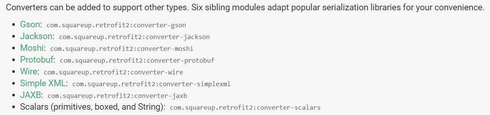

This Repository is my template for implementing RESTFul APIs interaction in the android app. There are 3 steps you need
to go through in order to add Retrofit to your project:
  

----------------------------------

The first step for adding Retrofit to your project is to copy the line below and paste it into the "dependencies"
section of the gradle file at "app/build.gradle".👇👇👇

The compiler will prompt you to change the version to the latest stable version automatically.

----------------------------------

Retrofit on its own, can only send and receive HTTP request/response bodies in the form of OkHttp objects. So, you as
the library's user can use any of the converters below for converting the response body (which is usually a JSON or XML
file) into data objects identifiable by kotlin/java 👇👇👇

In this project I have used Gson converter (but Moshi is currently the most famous library for doing so).

----------------------------------
